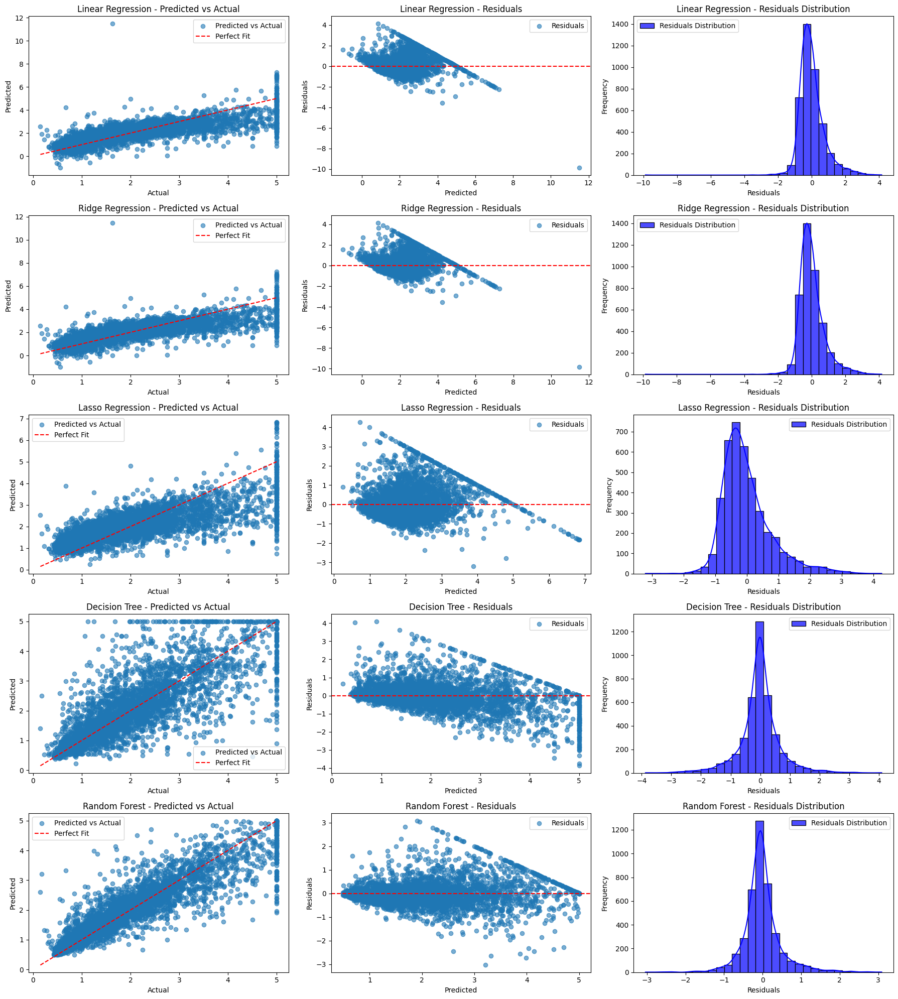
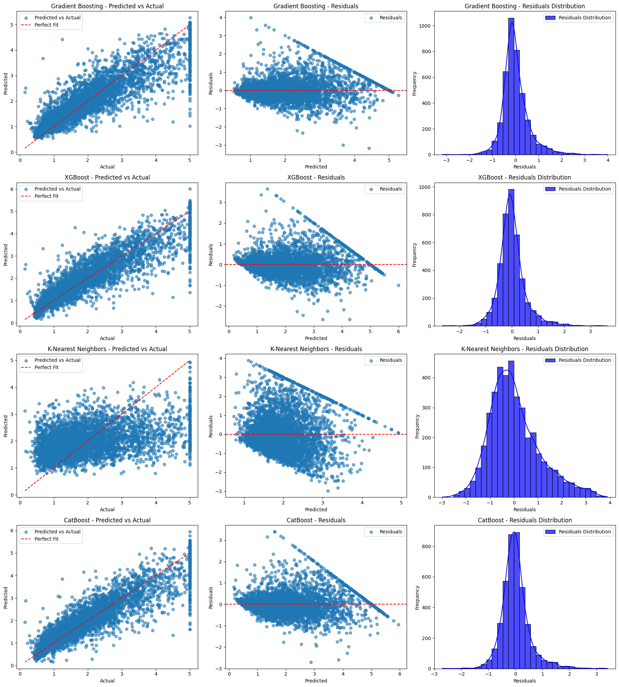

## Looking at Cost of Housing in California Using Statistics

### The main content of this project:

1. Visualize data and look for correlations (Pair Plots)
2. Heat map of housing prices using Folium
3. Formulate different hypotheses
4. Test different statistical methods and models

---

## Heat Map of Prices Using the Folium Library
Los Angeles is the hottest area in the heat map, which is expected as housing is generally more costly in large cities.

---

## Correlation Matrix (Heat Map)

---

## Comparison of Regression and ML Models
- Testing and comparing \(R^2\) and MSE
- Comparing residuals and performing Shapiro Test for normality

### Regression Models

---

### ML Models
